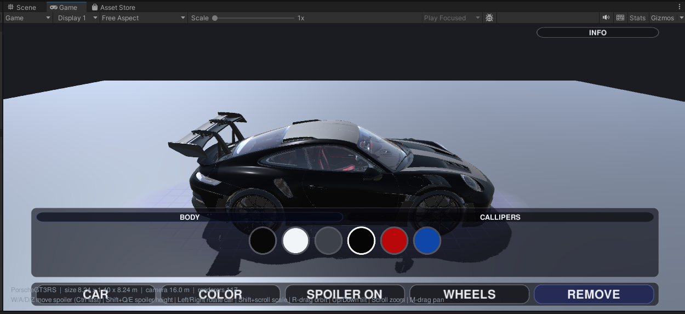
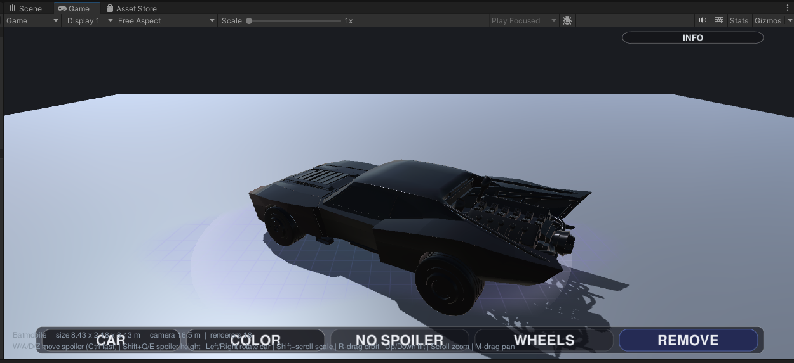
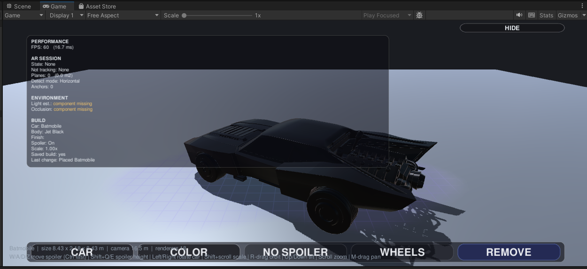
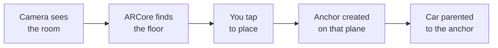

<div align="center">

# Build Your Ride AR

### Put a real-size car in your room. Walk around it. Paint it however you like.

An Android augmented-reality car configurator built in Unity.




</div>

---

## What it does

Point your phone at the floor and tap. A full-scale 3D car appears in the room with you,
scaled to its real length — a Porsche is genuinely 4.6 m long. Then walk around it and
change it live.

| | |
|---|---|
| **Place it** | Tap a detected floor plane. The car is anchored to that plane, so it stays where you put it as you move. |
| **Move it** | One finger drags, two fingers twist to rotate and pinch to resize. |
| **Paint it** | Body, wheels and brake callipers are separate paint groups, each with its own palette. |
| **Spoiler** | Cars with a real rear wing toggle it on and off. Cars without one get a modelled add-on spoiler mounted on the boot. |
| **Real lighting** | ARCore measures the actual brightness, colour and direction of light in your room and drives the scene light with it. |
| **Contact shadow** | An invisible surface under the car casts its shadow onto the real floor. This is the biggest thing that stops it looking pasted on. |
| **Occlusion** | On phones with the ARCore Depth API, real objects correctly hide the car. |
| **It remembers** | Each car keeps its own colours, spoiler and wheels. Reopen the app and your build is exactly as you left it. |

<table>
<tr>
<td width="50%">
<sub>Placed on a detected plane, with a contact shadow underneath</sub></td>
<td width="50%">
<sub>Built-in diagnostics: frame rate, session state, planes, current build</sub></td>
</tr>
</table>

---

## The cars

| Car | Length | Paint | Spoiler |
|---|:--:|---|---|
| **Porsche 911 GT3 RS (992)** | 4.60 m | Body · Wheels · Callipers | Built-in rear wing, toggles |
| **Maserati Quattroporte** | 5.26 m | Body · Wheels · Callipers | Add-on |
| **Generic Sport Coupe** | 4.50 m | Body · Wheels · Callipers | Add-on |
| **Batmobile** | 4.60 m | Callipers only | Built-in rear fins |
| **1936 American Sedan** | 5.00 m | — | — |

The 1936 Sedan is deliberately untouched — it renders exactly as its original artist
modelled it, as a reference point next to the modern cars.

---

## How placement works



**The last step is the one that matters.** The app does not drop a model where you pointed.
It creates an *anchor* attached to the detected plane and makes the car a child of it.
ARCore keeps revising where the floor really is as you walk around; because the car hangs
off the anchor, it follows those corrections and stays on the same physical spot.

The first version of this project skipped the anchor. That is why it drifted.

---

## The import pipeline

Adding a car by hand would mean clicking through hundreds of material slots. Instead one
generic pipeline turns any downloaded FBX into a finished, paintable car:

```
FBX file
  ↓  measure it and scale to its real length in metres
  ↓  detect a Z-up export and stand it on its wheels
  ↓  sort meshes into Body / Wheels / Callipers by material name
  ↓  build a colour palette per group
  ↓  find the boot and mount a spoiler there
  ↓  save as a prefab
Playable car
```

Sorting the meshes is the interesting part. A downloaded model has no idea what a "body"
is — it just carries material names like `EXT_caliper` or `TwiXeR_992_gt3rs_carbon_Wing`.
The mapper matches those against keyword lists, with exclusion rules so taillights and
window glass do not get repainted along with the bodywork.

Deeper detail on all of this: **[docs/ARCHITECTURE.md](docs/ARCHITECTURE.md)**

---

## Three bugs worth reading about

<details>
<summary><b>Every touch gesture was silently dead — for fifteen versions</b></summary>

<br>

Tap-to-place worked fine on the phone, but dragging, twisting, pinching — none of it did
anything. Nothing crashed, nothing showed up in the log, which is exactly why it took me so
long to track down.

Turned out a script file had gotten deleted and recreated at some point during development.
Unity identifies scripts by a GUID stashed in a sidecar file, and recreating the file gave it a
brand new one. The saved scene was still pointing at the old GUID, so the gesture component
sat there as an empty "Missing Script" placeholder — present, but doing absolutely nothing.

What made it sneaky is that both of my safety nets had a hole in exactly this spot. A
`GetComponent` fallback can never catch this, because a missing-script component isn't the
type you're asking for. And my scene-repair tool only ever wired the component up if it found
one already there — it never added a missing one, and its null check just swallowed the
failure silently.

Lesson I took from this: a null-guarded "wire it up" step isn't a repair.
`if (x != null) wire(x)` does nothing in exactly the case it was written to catch.

</details>

<details>
<summary><b>Turning the spoiler off made the whole car vanish</b></summary>

<br>

A change I made to catch the Porsche's wing struts ended up making the entire Porsche
invisible — all 116 meshes, nothing drawn.

I'd assumed the spoiler sat under its own parent node, so the logic pulled in anything sharing
that parent. But this particular model's hierarchy is completely flat — engine, seats,
dashboard, and wing are all direct children of one single node. So the moment anything matched
my keyword, "everything sitting next to it" resolved to the entire car.

The keyword that tripped it was `rod`, which also happened to match the suspension's
push-rods and tie-rods.

What I took away from it: check the real model hierarchy before assuming a structure, and
trust the diagnostics log over my own guess at what went wrong.

</details>

<details>
<summary><b>Saving your colour choice froze the app</b></summary>

<br>

Writing to disk on Android takes 10–50 ms, and I had the app saving on every single colour
tap — so flicking through a palette meant a dozen blocking disk writes back to back, which you
could actually feel as stutter.

I'd already built a "wait two seconds, then save once" system to fix exactly this. Except it
had never once actually run — every call site went straight to the immediate-save method
instead, so that delay window never opened.

Fixed now: frequent actions use the delayed save, and the instant save is reserved for placing
a car, switching cars, and closing the app. I also moved the save-pump off a debug component,
since hanging real data persistence off something meant to be stripped from release builds is
a quiet way to lose someone's saved car.

</details>

---

## Performance

An AR app has to hold 30–60 fps while also running camera, tracking and depth sensing.

| Change | Effect |
|---|---|
| **Texture compression + streaming** | ~200 car textures were fully loaded from launch whichever car you picked. Now compressed and streamed on demand — **114 MB → 57 MB**. |
| **Deferred saving** | Colour taps no longer block on disk writes. |
| **Cached bounds** | Hit-testing your finger against the car used to walk 209 meshes on every touch. Now measured once. |
| **Frame-rate independent smoothing** | `Lerp(a, b, rate * deltaTime)` moves at different speeds at 30 and 60 fps. Replaced with an exponential-decay form that behaves identically on both. |
| **Shadow range 150 m → 30 m** | A leftover Unity default was rendering cascades across six times more distance than a room-scale app uses. |

Result: **60 fps on a Galaxy S23**, 57 MB APK.

---

## Not solved yet

- **The car doesn't remember its place in the world.** Colours, size, and angle survive a
  restart; the physical spot doesn't, because every AR session starts from a fresh origin.
  Doing that properly needs cloud anchors, which I haven't built yet.
- **Occlusion needs a Depth-capable phone.** Without one, the car just draws over everything.
- **Draw calls are high on the detailed cars** — 209 on the Maserati, 116 on the Porsche.
  LOD meshes and texture atlasing are next on my list.
- **Portrait only**, in practice.

---

## Running it

The full Unity project is in [`BuildYourRideAR/`](BuildYourRideAR/) — 29 C# scripts
(19 runtime, 10 editor tooling), 2 custom shaders, 5 cars, one scene.

Open it in **Unity 2022.3.61f1**, open `Assets/Scenes/Main.unity`, run
**`BuildYourRide > Upgrade Scene`**, and press Play. **No phone needed** — with no AR
hardware present the app substitutes a floor and an orbit camera, so the whole flow is
testable in the editor.

To build an APK: `./build.sh` from inside `BuildYourRideAR/`, with Unity closed.

Setup, controls, menu commands and troubleshooting:
**[BuildYourRideAR/README.md](BuildYourRideAR/README.md)**

> The release signing key is not in this repository, so builds from a fresh clone are
> debug-signed. Everything else works as-is.

---

## About

Built by **Sathvik Koti** — Robotics and Embedded AI, Maynooth University.

This started as a university 3D Vision project — one car, a plain colour button, and a model
that drifted away from where I put it as I walked around. Writing up that first version made
it obvious what was actually wrong: the anchoring drifted, and the car looked pasted onto the
screen instead of actually being in the room.

So this is the full rebuild, aimed squarely at those two problems — plane-attached anchoring
for the drift, and real light estimation, contact shadows, and depth occlusion for the "pasted
on" feeling. Everything else in here grew out of chasing those two.

<sub>3D car models are free community assets, used for a non-commercial academic project.</sub>
