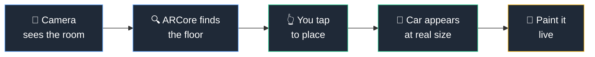
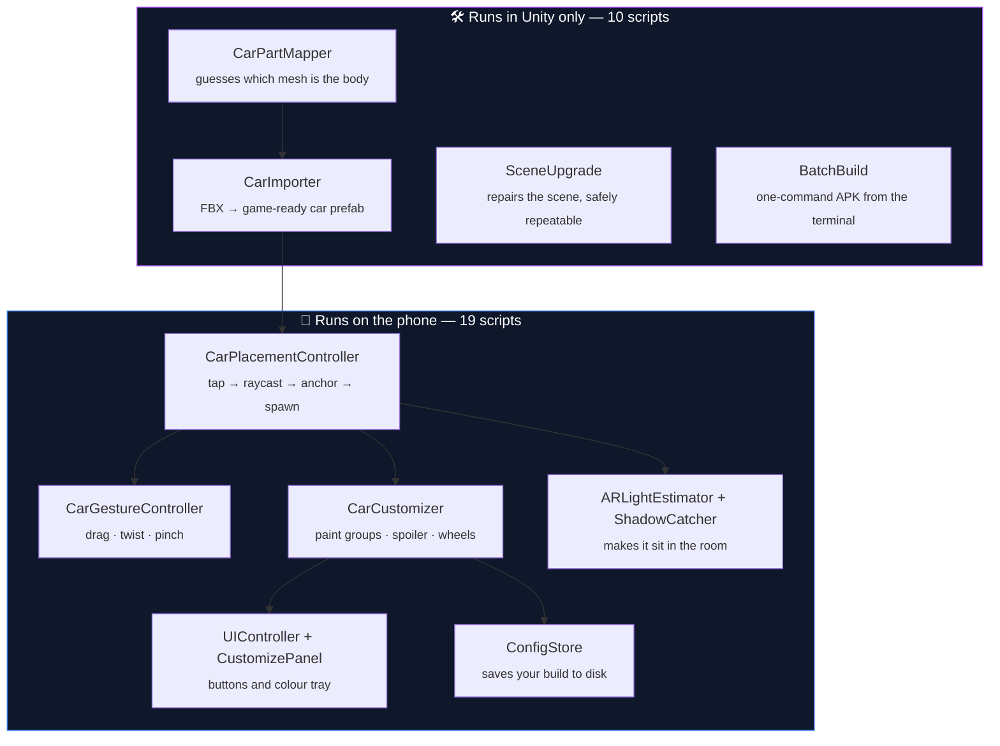

<div align="center">

# Build Your Ride AR

### Put a real-size car in your room. Walk around it. Paint it however you like.

An Android augmented-reality car configurator built in Unity.
Point your phone at the floor, tap, and a full-scale car appears in the room with you.

<br>


<br>


<sub><i>Porsche 911 GT3 RS — pick a body colour, flip the rear wing, change the wheels</i></sub>

</div>

<br>

---

## What is this?

Buying a car online is hard because you cannot see it. Photos lie about size. A showroom
only has a few colours on the floor.

This app fixes that. It uses your phone camera to place a **real-size 3D car** on the floor
in front of you. You can then:

- Walk around it, crouch down, look inside the wheel arches
- Change the **body colour**, the **wheel colour**, the **brake calliper colour**
- Turn the **rear spoiler** on and off
- Move, rotate and resize the car with your fingers
- Close the app and come back later — your car remembers exactly how you left it

Everything happens live, on the phone, with the real lighting of the room you are standing in.

<br>

---

## See it running

<table>
<tr>
<td width="50%">

<br><sub><b>Batmobile</b> — placed on a detected floor plane, with a soft contact shadow underneath it</sub>
</td>
<td width="50%">

<br><sub><b>Live diagnostics</b> — frame rate, AR session state, detected planes, and the exact build of the car on screen</sub>
</td>
</tr>
</table>

<br>

---

## How it works

Five steps, from raw camera feed to a car you can paint.



**The important part is step 3 → 4.** When you tap, the app does not just drop a model
where you pointed. It creates an **anchor** attached to the detected floor plane, then parents
the car to that anchor. ARCore keeps re-estimating where the floor really is as you walk
around, and the car follows along. That is what stops the car sliding away from where you
put it.

<br>

---

## What is in the app

<table>
<tr><th width="22%">Feature</th><th>What it does</th></tr>

<tr>
<td><b>🚗 Tap to place</b></td>
<td>Scan the floor, tap once, and a full-scale car is standing in your room. Every car is scaled to its real manufacturer length, so a Porsche is genuinely 4.6 m long.</td>
</tr>

<tr>
<td><b>✋ Finger controls</b></td>
<td>One finger drags the car across the floor. Two fingers twist to rotate it and pinch to resize it.</td>
</tr>

<tr>
<td><b>🎨 Per-part paint</b></td>
<td>Body, wheels and brake callipers are three separate paint groups, each with its own palette. Tap a colour chip and it applies instantly.</td>
</tr>

<tr>
<td><b>🪽 Spoiler toggle</b></td>
<td>Cars with a real rear wing in the model toggle it on and off. Cars without one get a modelled add-on spoiler mounted at the correct spot on the boot.</td>
</tr>

<tr>
<td><b>💡 Real room lighting</b></td>
<td>ARCore measures the actual brightness, colour and direction of light in your room and drives the scene light with it. A car in a warm living room looks warm.</td>
</tr>

<tr>
<td><b>🌑 Contact shadow</b></td>
<td>An invisible surface under the car catches its shadow and paints it onto the real floor. This is the single biggest thing that stops the car looking "pasted on".</td>
</tr>

<tr>
<td><b>🫥 Depth occlusion</b></td>
<td>On phones with the ARCore Depth API, real objects correctly hide the car. Walk behind a table and the table blocks the bonnet.</td>
</tr>

<tr>
<td><b>💾 It remembers</b></td>
<td>Every car keeps its own colours, spoiler state and wheels. Close the app, reopen it, and your build is exactly as you left it.</td>
</tr>

<tr>
<td><b>📊 Live diagnostics</b></td>
<td>A built-in overlay shows frame rate, AR session state, plane count, anchor count and the current build — plus a full log written to disk on every run.</td>
</tr>

</table>

<br>

---

## The cars

Five cars ship in the app, each scaled to its real-world length.

| | Car | Length | Paint | Spoiler |
|:--:|---|:--:|---|---|
| 🏎️ | **Porsche 911 GT3 RS (992)** | 4.60 m | Body · Wheels · Callipers | Real built-in rear wing, toggles on/off |
| 🚙 | **Maserati Quattroporte** | 5.26 m | Body · Wheels · Callipers | Add-on spoiler |
| 🏁 | **Generic Sport Coupe** | 4.50 m | Body · Wheels · Callipers | Add-on spoiler |
| 🦇 | **Batmobile** | 4.60 m | Callipers (body stays black) | Built-in rear fins |
| 🚘 | **1936 American Sedan** | 5.00 m | — | — |

The 1936 Sedan is deliberately left alone. It renders exactly the way its original artist
modelled it, as a reference point next to the modern cars.

<br>

---

## Built with

<table>
<tr>
<td width="33%" valign="top">

**Engine**
- Unity 2022.3.61f1
- Built-in Render Pipeline
- C# — 8,200+ lines

</td>
<td width="33%" valign="top">

**AR**
- AR Foundation 5.1.5
- ARCore 5.1.5
- Plane detection + anchors
- Environmental HDR lighting
- Depth API occlusion

</td>
<td width="33%" valign="top">

**Target**
- Android, minSdk 24
- IL2CPP, ARM64
- Vulkan + GLES3
- Linear colour space
- Tested on Galaxy S23

</td>
</tr>
</table>

<br>

---

## Under the hood

The app is 29 C# scripts split into two halves: code that runs on the phone, and editor
tools that only run inside Unity to build the content.



### The car import pipeline

Adding a car by hand would mean clicking through hundreds of material slots. Instead, one
generic pipeline turns any downloaded FBX into a finished, paintable car:

```
FBX file
   ↓  measure the model and scale it to its real length in metres
   ↓  detect if it was exported Z-up and stand it on its wheels
   ↓  read every material name and sort meshes into Body / Wheels / Callipers
   ↓  build a colour palette for each group
   ↓  find the boot and mount a spoiler there
   ↓  save as a prefab
Playable car
```

Sorting the meshes is the interesting bit. A downloaded model has no idea what a "body"
is — it just has material names like `EXT_caliper` or `TwiXeR_992_gt3rs_carbon_Wing`.
The mapper matches those names against keyword lists, with exclusion rules so that
taillights and window glass do not get repainted along with the bodywork.

<br>

---

## Problems worth talking about

Real engineering is mostly finding out why something does not work. A few of the better ones:

<details>
<summary><b>🐛 Every touch gesture was silently dead — for fifteen versions</b></summary>

<br>

Tap-to-place worked on the phone, but drag, twist and pinch did nothing. Nothing crashed
and nothing appeared in the log, which is what made it so hard to see.

The cause: a script file was deleted and recreated during development. Unity identifies
scripts by a GUID stored in a small sidecar file, and recreating the file generated a
**new GUID**. The saved scene still pointed at the old one, so the gesture component
became an empty "Missing Script" placeholder — present in the scene, doing nothing.

Two safety nets both had holes. A `GetComponent` fallback could never work, because a
missing-script component is not the type you are asking for. And the repair tool only ever
*wired up* the component if it found one — it never **added** it, and its null check
swallowed the failure without a word.

**Fixed by** stripping missing-script components from the whole scene, adding a real
gesture component, and adding it to the startup checklist so the same failure shouts
instead of hiding.

**Lesson:** a null-guarded "wire it up" step is not a repair. `if (x != null) wire(x)`
does nothing in exactly the case you wrote it for.

</details>

<details>
<summary><b>🐛 Turning the spoiler off made the whole car vanish</b></summary>

<br>

A change meant to find the Porsche's wing struts instead made the entire Porsche
invisible — 116 meshes, none of them drawn.

The logic assumed a spoiler sits under its own parent node in the model, so it pulled in
anything sharing that parent. But this model's hierarchy is completely **flat** — engine,
seats, dashboard and wing are all direct children of one node. So the moment any mesh
matched a keyword, "everything next to it" resolved to *the entire car*, and switching the
spoiler off hid all of it.

The keyword that triggered it was `rod`, which matched the suspension **push-rods** and
**tie-rods**.

**Lesson:** check the actual model hierarchy before assuming a structure, and trust the
diagnostics log over a verbal bug description.

</details>

<details>
<summary><b>🐛 Saving your colour choice froze the app</b></summary>

<br>

Writing to disk on Android takes 10–50 ms. The app saved on every single colour tap — so
flicking through a 13-colour palette meant thirteen blocking disk writes and visible stutter.

A "wait 2 seconds, then save once" system had been designed to fix this. It had never once
run: every caller went straight to the immediate-save method instead, so the delay window
never opened.

**Fixed** by routing the frequent actions (colour, spoiler, wheels, gestures) to the delayed
save, and keeping the instant save only for rare moments — placing a car, switching cars,
and the app closing.

The save pump was also moved off a debug component, because hanging your data persistence
off something you plan to strip from the release build is a very quiet way to lose user data.

</details>

<details>
<summary><b>🐛 The debug marker that shipped to real users</b></summary>

<br>

A tracking tool for measuring anchor drift parented a bright orange 6 cm sphere to the car
so drift could be seen. Every other debug tool in the project checked whether it was running
in the editor. This one did not — so the sphere was being rendered **inside every car in the
shipped app**.

**Fixed** by keeping the measurement and gating only the visible marker to development builds.

</details>

<details>
<summary><b>🐛 Corrupt car files that reported success</b></summary>

<br>

Two cars refused to import, with Unity reporting only "unexpected file type". The models
were packed inside RAR archives, and the extraction tool could not decode RAR5 — so it wrote
**0-byte files and exited with a success code**.

**Lesson:** always check the size of an extracted file. A zero-error exit code is not proof
that anything came out.

</details>

<br>

---

## Making it fast

An AR app has to hold 30–60 fps while also running camera, tracking and depth sensing.

| Change | Why |
|---|---|
| **Texture compression + streaming** | Around 200 car textures were fully loaded from launch, whichever car you picked. Now compressed and streamed on demand — the app went from **114 MB to 57 MB**. |
| **Delayed saving** | Colour taps no longer block on disk writes. |
| **Cached bounds** | Testing whether your finger hit the car used to walk 209 meshes on every touch. Now measured once, cached. |
| **Frame-rate independent smoothing** | Smoothing written as `Lerp(a, b, rate * deltaTime)` moves at different speeds on a 30 fps and a 60 fps phone. Replaced with an exponential-decay form that behaves identically on both. |
| **Shadow range 150 m → 30 m** | A leftover Unity default was rendering shadow cascades across six times more distance than a room-scale app ever uses. |
| **Debug code stripped** | Log writes on every touch, per-frame keyboard polling and a 209-line inventory dump per placement — all removed from release builds. |
| **Linear colour space** | The cars are PBR models lit by real-world light estimation. Both assume light adds up linearly; in the wrong colour space, metallic paint reads flat and dull. |

<br>

---

## By the numbers

<div align="center">

| | | | |
|:--:|:--:|:--:|:--:|
| **8,278** | **29** | **5** | **57 MB** |
| lines of C# | scripts | cars | final APK |
| **2** | **37** | **~200** | **60 fps** |
| custom shaders | materials | textures | on a Galaxy S23 |

</div>

<br>

---

## Controls

**On the phone**

| Do this | Get this |
|---|---|
| Tap the glowing floor | Place the car |
| Drag with one finger | Move it around the room |
| Twist with two fingers | Rotate it |
| Pinch with two fingers | Make it bigger or smaller |
| **CAR** | Next car |
| **COLOR** | Open the colour tray |
| **SPOILER** | Wing on / off |
| **WHEELS** | Cycle wheel colour |
| **REMOVE** | Take the car away |
| **INFO** | Show live diagnostics |
| Back button | Step back one level, then quit |

**Testing on a desktop**, the app detects there is no AR hardware, removes the AR camera
stack, lays down a grey floor and gives you an orbit camera — so the whole flow can be
tested without a phone.

<br>

---

## What is not solved yet

Being straight about limits is more useful than pretending there are none.

- **The car does not remember its place in the world.** Colours, size and angle survive a
  restart. The physical spot does not, because every new AR session starts a fresh origin.
  Doing this properly needs cloud anchors.
- **Occlusion needs a Depth-capable phone.** Without it the car simply draws over everything,
  with no error.
- **Draw calls are high on the detailed cars** — 209 on the Maserati, 116 on the Porsche.
  Level-of-detail meshes and texture atlasing are the next real win.
- **Portrait only, in practice.** The layout is built for portrait; landscape lays out badly.

<br>

---

## The code

The full Unity project is in this repository.

```
build-your-ride-ar/
├── README.md                 ← you are here
├── docs/
│   ├── ARCHITECTURE.md       how it is built, in detail
│   └── images/               screenshots
└── BuildYourRideAR/          the Unity project
    ├── Assets/
    │   ├── Scenes/Main.unity     the only scene
    │   ├── Scripts/              19 files — runs on the phone
    │   ├── Editor/               10 files — content pipeline and scene tools
    │   ├── Shaders/              ARPlaneGlow, ShadowCatcher
    │   ├── Models/               5 cars + textures
    │   ├── Prefabs/  Materials/  Textures/
    ├── Packages/  ProjectSettings/
    └── build.sh                  one-command APK from the terminal
```

**To run it:** open `BuildYourRideAR/` in **Unity 2022.3.61f1**, open `Assets/Scenes/Main.unity`,
run **`BuildYourRide > Upgrade Scene`**, and press Play. No phone needed to try it — the app
detects there is no AR hardware and substitutes a floor and an orbit camera.

**To build an APK:** `./build.sh` from inside `BuildYourRideAR/`, with Unity closed.

Full setup, controls, menu commands and troubleshooting:
**[BuildYourRideAR/README.md](BuildYourRideAR/README.md)**

> The release signing key and its password are **not** in this repository, so builds from a
> fresh clone are debug-signed. Everything else works as-is.

<br>

---

## About

Built by **Sathvik Koti** — Robotics and Embedded AI, Maynooth University.

This started as a university 3D Vision project with one car, a plain colour button, and a
model that drifted away as you walked. That first version's own conclusion named the two
things wrong with it: **the anchoring drifted**, and **the car looked pasted onto the
screen rather than present in the room**.

This is the full rebuild that went after exactly those two problems — plane-attached
anchoring for the first, and real light estimation plus contact shadows and depth occlusion
for the second. Everything else grew from there.

3D car models are free community assets, used for a non-commercial academic project.

<div align="center">
<br>
<sub>⭐ If you found this interesting, a star is always appreciated</sub>
</div>
